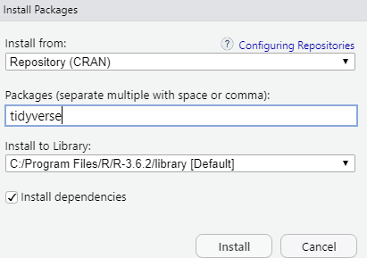
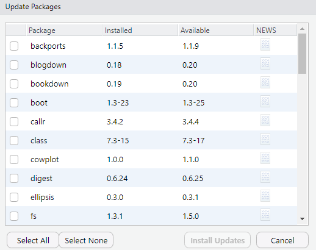

# What are packages?

Packages are plug-ins that make R easier to use. Think of R as a smartphone, a package as an app you download from CRAN, the app store.

  <strong>⚠️ Install Local</strong>
  

  Do not install packages on your Suffolk One Drive account or any other cloud service. Make sure you install on your computer's hard drive. 

  <strong> ℹ️ Stay up to date</strong>
  

  We recommend that you update your operating system to its latest version. Otherwise you may run into problems installing R or packages for R. 

# Instructions

There are two main ways you can download a package inside R Studio.

## At the console

Run the code `install.packages("packagename")` at the console. For instance, to install the tidyverse, do `install.packages("tidyverse")`. 

[VIDEO HERE]

## From the dropdown menu

Open R Studio, go to "Tools" (the dropdown menu), select "Install packages", and then enter the name of the package you want to install.

For instance, to install `tidyverse`:

 

{width=75%}

 

and then click "Install". 

Make sure:

* you **don't** change the installation location (leave it to the default)
* you **do** select "install dependencies" (so that if the package requires other packages you don't have, those packages are also installed).

## Updating packages

From time to time you may need to update a package. Easiest way is to open R Studio, go to "Tools", then select "Check for package updates". A dialog box will appear. Select any and all packages you want to update, then click "Install Updates". It looks something like this:

 

{width=75%}

 

