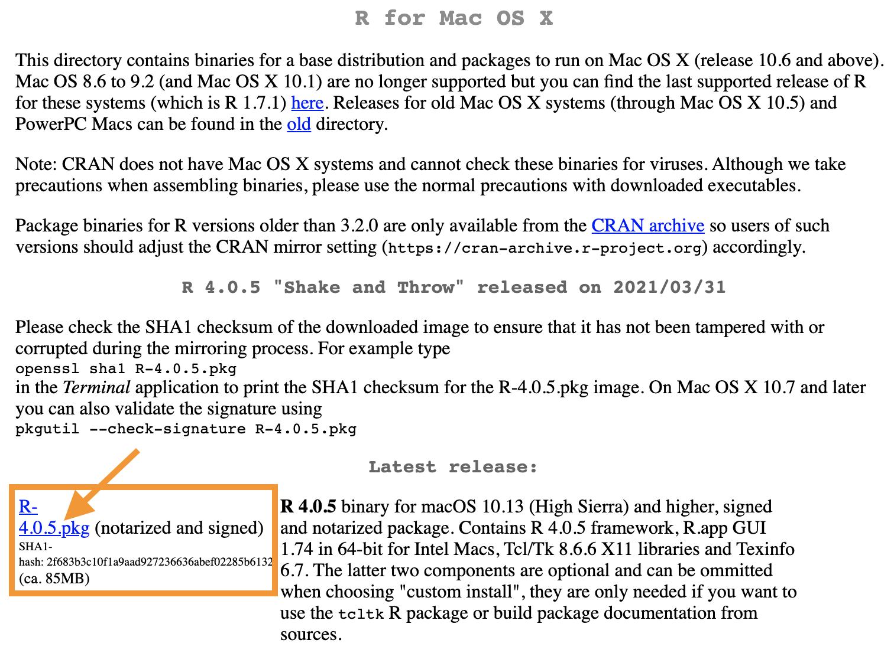
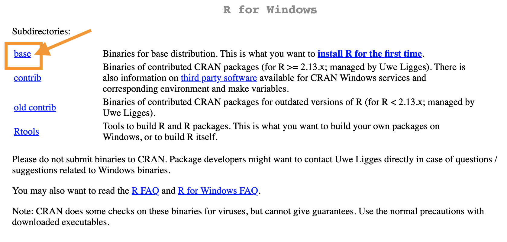
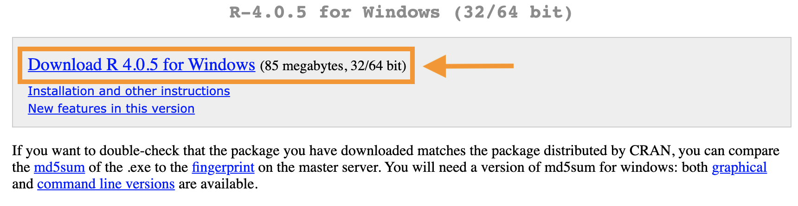

# Instructions

1. Go to the [CRAN mirror](https://www.r-project.org/) -- the worldwide server on which R is stored -- and click "download R".
2. "CRAN" means "Comprehensive R Archive Network". It's a network of servers around the world connected together to store the language. You need to choose a "mirror" or a server near you. We're in Boston, so we'll scroll down to "USA" and choose the page for "Statlib, Carnegie Mellon University, Pittsburgh, PA": http://lib.stat.cmu.edu/R/CRAN/.
3. At the top of that page choose your operating system: Linux, Mac OS X, or Windows. Follow the download instructions. 

  <strong>⚠️ Install Local</strong>
  

  Do not install software like R on your Suffolk One Drive account or any other cloud service. Make sure you install on your computer's hard drive. 

  <strong> ℹ️ Stay up to date</strong>
  

  We recommend that you update your operating system to its latest version. Otherwise you may run into problems installing R or packages for R. 

## Mac OS X

You should see this a page like in this picture. Click on the highlighted link:

 

{width=75%}

 

## Windows 

You should this page below. Click on the link to "base":

 

{width=75%}

 

That will take you to the download page:

 

{width=75%}

 

## Video instructions

Here are video instructions for Windows. The process is very similar for Mac. 

