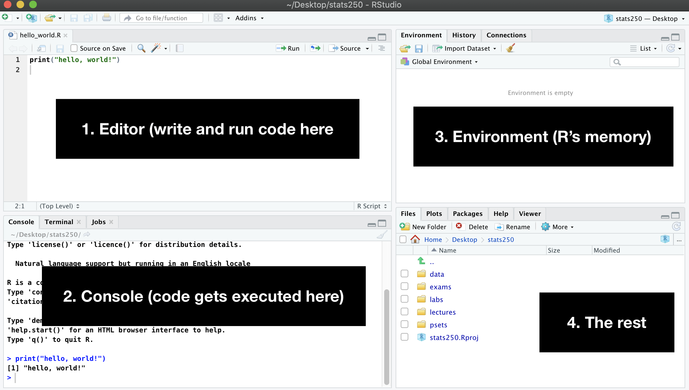

# Why R Studio? 

[R Studio](https://www.rstudio.com/) is an integrated development environment (IDE) that makes it a lot easier to use and manage R. You can write code to do everything from analyzing data to building apps and websites. (This website was built entirely in R Studio.) After you download the app, scroll down to see a demo. 

  <strong>⚠️ Is R installed?</strong>
  

  Before installing R Studio, you first need to install R.  

# Instructions

1. Go to the [download page](https://www.rstudio.com/products/rstudio/download/#download).
2. Choose the link for your operating system, then follow the download instructions. 

 

{width=75%}

 

  <strong>⚠️ Install Local</strong>
  

  Do not install software like R on your Suffolk One Drive account or any other cloud service. Make sure you install on your computer's hard drive. 

  <strong> ℹ️ Stay up to date</strong>
  

  We recommend that you update your operating system to its latest version. Otherwise you may run into problems installing R or packages for R. 

# Navigating R Studio

Open R Studio and any file and you will see are four panels:

1. The editor (where you write and edit files)
2. The console (where code is executed)
3. The environment (R's memory: data sets, functions, objects, and more)
4. The rest (file manager, plots, packages, viewer)

 

{width=95%}

 

You can customize pretty much everything in R Studio, including the appearance (Monokai forever!). More details [here](https://support.rstudio.com/hc/en-us/articles/200549016-Customizing-RStudio). 