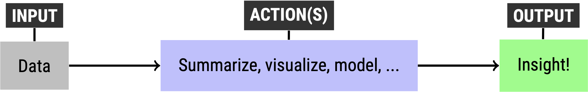

# What is R?

R is one of the [most popular programming languages](https://stackoverflow.blog/2017/10/10/impressive-growth-r/) for economics and data science.

R -- and it's integrated development environment (IDE) [RStudio](https://rstudio.com/) -- lets you easily:

* analyze data;
* create beautiful and insightful visualizations;
* write reproducible and interactive papers and slideshows that combine programming, stats and text;
* build websites;
* and [more](https://rmarkdown.rstudio.com/gallery.html)! 

# Why should you learn R?

Here are five reasons:

## 1. It's free

Unlike Excel or SPSS or Stata. 

## 2. It makes it easier to do science

Science is about learning from data.

In R, you learn from data by writing **programs** with **code**. 

**A program is like a recipe**. A recipe:

* tells you what are the ingredients;
* what to do with the ingredients;
* what you will get at the end.

If you write down a recipe for an omelette, you can share it with someone so they can eat as well as you do. 

Same goes for a program. You can share them with others so they can learn what you learned. (A written program also helps you remind yourself what you did!)  

Contrast this to point-and-click software like Excel or SPSS, where you mostly have to navigate drop-down menus, and thus have no breadcrumbs to follow when you come back to a project.

## 3. It has big network effects

There is tons of software out there. You can't learn them all. So how do you choose? 

A rule of thumb is to choose software that many others in your field of interest use. The benefits you get by learning a software with big community of users are called **network effects**. 

The network effects to R are huge. Data scientists in industry use R. Academics use R. The list goes on. 
Why is this important? Because that whatever problem you run into, [somebody has probably found a solution](https://stackoverflow.com/questions/tagged/r). 

Network effects also mean that other users invest into improving the software, making it a better experience for you. 

## 4. It has big spillover benefits 

Just like learning Spanish makes it easier to learn French, learning one programming language -- like R -- will make it easier to learn another one -- like Python.

More generally, learning how to code will teach you a **style of thinking** that will help you **abstract and problem-solve**. 

(It's one reason why [coding and creative writing](https://refuses.github.io/preprints/writing.pdf) are closer to each other than you might think.)

## 5. It literally pays off

R is widely used in business analytics and data science. The website [levels.fyi](https://www.levels.fyi/) publishes salaries for different levels of these careers.

According to GlassDoor, the average salary to an R programmer is nearly [$100,000](https://www.glassdoor.com/Salaries/r-programmer-salary-SRCH_KO0,12.htm).

([Here](https://www.datacamp.com/community/blog/comparing-r-programmer-wages-by-industry) is some more salary data broken by field.)

# Why not...

There is no one software to rule them all. We chose R because it is built for data analysis, it is free, and it is widely used in industry and academics. 

It is common for analysts to use multiple tools. We recommend you start with one, get good at it, and then branch out. 

## ...Excel? 

Excel is great for lots of simple things. You should learn it, too. But R is better for almost any kind of data analysis. 

## ...Python? 

Python is great. You should learn it, too. Especially if you plan on a career in data science. But it is easier to start with one language and then switch to another. (Heads up, [you can use Python in R Studio](https://blog.rstudio.com/2018/03/26/reticulate-r-interface-to-python/).) We prefer R because unlike Python, a general programming language, R was built specifically to analyze data and build models.

## ...Stata?

Stata is an incredible tool for econometrics. The problem is that it is built for academics, and thus is not widely used in industry. 

# How do you learn R?

By doing it!

**Everybody is bad at R in the beginning.**

The more you use R, the better you will get at coding -- and the more you will have fun doing science and learning about the world. 

## What is coding?

Coding is like **cooking.** 

Say you want to make an omelette. 

First you need **inputs**:

* **eggs**;
* and some of other **stuff**.

Then you need to **act** on those inputs:

* **whisk** the eggs;
* **mix** the other stuff;
* **pour** into a pan;
* **cook** the mixture;
* etc.

"Whisk", "mix", "pour", "cook" are verbs. They *act* on the nouns "eggs" and "stuff". Specifically, they **transform** those inputs into an **output**: the omelette. 

So in a way, cooking is like:

 

{width=75%}

 

## What does this have to do with science? 

Say you have some data. That's your **input**. 

Then you act on the data: summarize it, plot it, model it, learn from it. 

What is your **output**? A plot, a table, a model, etc. In other words, insight!

 

{width=75%}

 

## What is the takeaway?

Coding is about the *actions*. 

Just like you might tell your sous-chef to whisk the eggs, you tell a software -- like R -- to plot the data. 

That means you have to *speak* to R in a language it understands. You have to speak to R in computer code. 

And like learning any language, there is no secret formula. You just have to practice, practice, practice.

